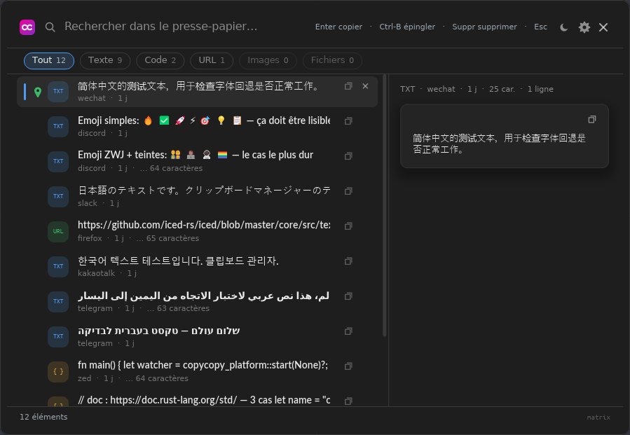

# copycopy

A clipboard manager in Rust. Everything you copy, one keystroke away.



A resident process captures continuously — text, code, images, files — and the
window opens on **`Ctrl+Alt+V`** (`Cmd+Shift+V` on macOS). Type three letters,
press `Enter`, it is back on your clipboard.

- **Nothing leaves the machine.** No account, no cloud, no telemetry.
- **Secrets are never stored.** Anything a password manager marks as
  confidential is dropped before it is written.
- **100 000 entries at 59 fps**, on a hand-virtualised list.
- **Portable**: drop a `copycopy.conf` next to the executable and the
  configuration, the database and the images live in that folder.

## Installing

Packages are attached to every [release](../../releases). Nothing is signed:
Windows shows a SmartScreen warning — *More info* → *Run anyway* — and macOS
refuses the first open — right-click the app → *Open*.

| System | File |
|---|---|
| Windows | `copycopy-windows-x86_64.exe`, or `…-portable.zip` |
| Linux | `copycopy-linux-x86_64.AppImage`, or the `.deb` |
| macOS | `copycopy-macos-universal.dmg` |

From source, a Rust toolchain is all it takes — SQLite is compiled in:

```bash
cargo build --release -p copycopy
```

## Where it runs

| | |
|---|---|
| Windows | run for real, in daily use |
| Linux X11 | run and tested |
| Linux Wayland | written, built in CI, never executed |
| macOS | written, built in CI, never executed |

Under Wayland there is no client-side global shortcut: bind one in your
compositor that runs `copycopy --show`.

## Layout

| Crate | Role |
|---|---|
| `copycopy-core` | model, history, SQLite FTS5, language detection and colouring |
| `copycopy-platform` | capture, one backend per system |
| `copycopy` | the binary: iced daemon, window, global shortcut |

The working notes — why each decision was made, what was tried and dropped,
what is verified where — are in **[docs/notes.md](docs/notes.md)**
([français](docs/notes.fr.md)).

*Une version française de ce document est disponible dans [README.fr.md](README.fr.md).*

## Licence

MIT. See [LICENSE](LICENSE).
