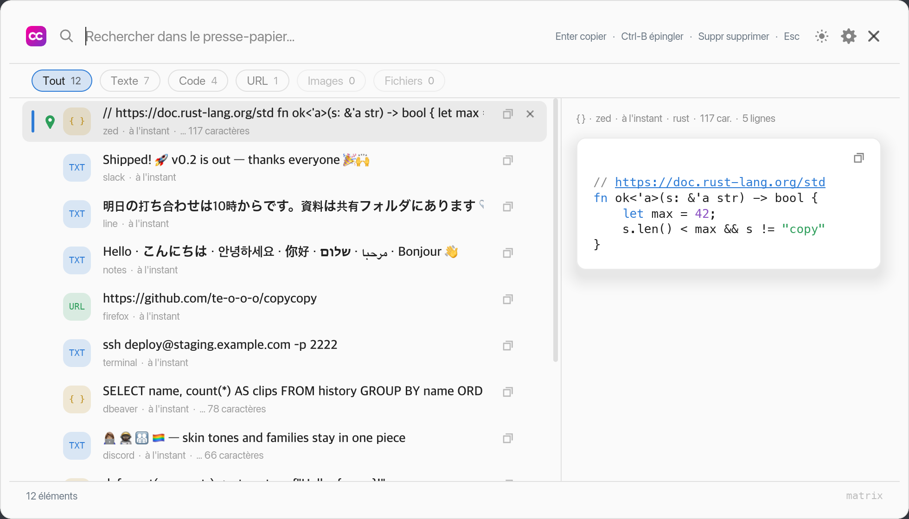
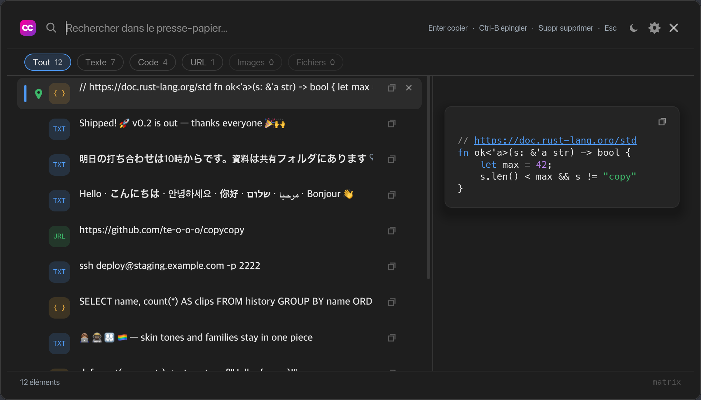

<h1 align="center">copycopy</h1>

<p align="center">
  A clipboard manager that remembers everything you copy —<br>
  except your passwords. It's nosy, not evil.
</p>

<p align="center"><sub>v0.1.0 · Rust · Windows, Linux, macOS · MIT</sub></p>

<p align="center">
  <a href="#install">Install</a> ·
  <a href="#use">Use</a> ·
  <a href="#where-it-runs">Where it runs</a> ·
  <a href="docs/notes.md">Notes</a> ·
  <a href="README.fr.md">Français</a>
</p>

<table align="center">
  <tr>
    <td align="center"><br><sub>Light</sub></td>
    <td align="center"><br><sub>Dark</sub></td>
  </tr>
</table>

Text, code, links, images, files: a small resident keeps everything you copy,
and a shortcut brings it back. English, 日本語, emoji 🎉 and code all included.

- **Nothing leaves your machine.** No account, no cloud, no telemetry.
- **Secrets are never stored.** What a password manager marks as confidential
  is dropped before it is written.
- **Fast.** 100 000 entries, still 59 fps.
- **Portable.** Put a `copycopy.conf` next to the executable and everything
  lives in that folder.

## Install

Grab the package for your system from the [releases](../../releases):

| System | File |
|---|---|
| macOS | `copycopy-macos-universal.dmg` |
| Windows | `copycopy-windows-x86_64.exe`, or `…-portable.zip` |
| Linux | `copycopy-linux-x86_64.AppImage`, or the `.deb` |

Nothing is signed, so the first launch gets a warning:

- **macOS**: `xattr -dr com.apple.quarantine /Applications/copycopy.app`, or
  try once, then *System Settings → Privacy & Security → Open Anyway*.
- **Windows**: *More info* → *Run anyway*.

Or build from source. A Rust toolchain is all it takes:

```bash
cargo build --release -p copycopy && ./target/release/copycopy
```

## Use

| | |
|---|---|
| **`Cmd+Shift+V`** (macOS), **`Ctrl+Alt+V`** (elsewhere) | open the window |
| type | search |
| `Enter` | copy back and close |
| `Ctrl+B` | pin |
| `Esc` | close |

## Where it runs

| | |
|---|---|
| Windows | in daily use |
| macOS | run on Apple Silicon |
| Linux X11 | run and tested |
| Linux Wayland | built by the CI, never run: bind a shortcut to `copycopy --show` in your compositor |

Why it is built the way it is, and what is verified where:
**[docs/notes.md](docs/notes.md)**.

## License

MIT, see [LICENSE](LICENSE).
